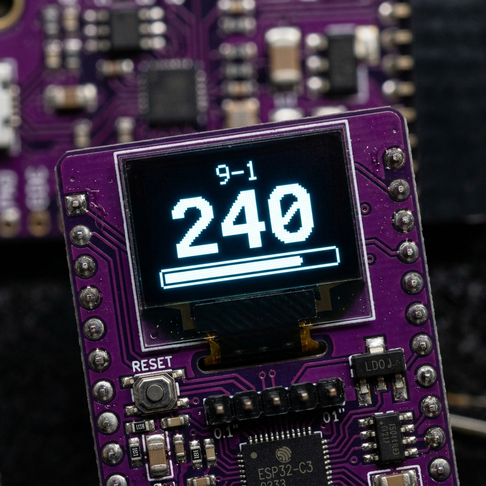
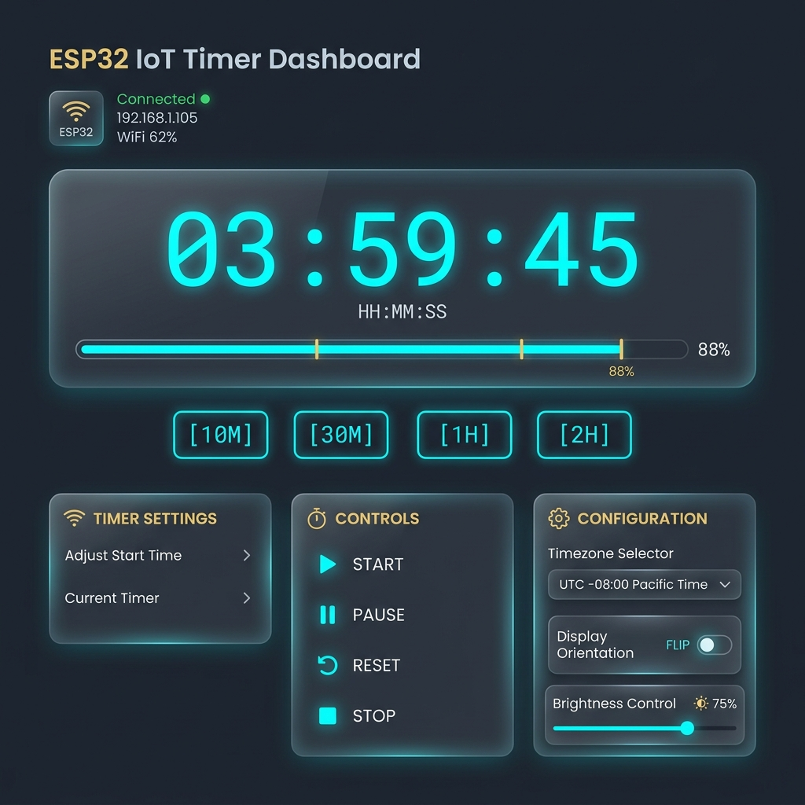

# ESP32-C3 0.42" OLED Schedule Timer & Web Portal

<p align="center">
  
  &nbsp;&nbsp;
  
</p>

A feature-packed MicroPython project for the **ESP32-C3 Supermini Development Board** featuring an onboard **0.42-inch OLED display (SH1106 controller)**. It maintains real-time NTP synchronization, executes a **5-block customizable daily countdown schedule**, renders dynamically scaled numbers to maximize screen space, and hosts an asynchronous **dark-mode web dashboard** for real-time control and customizations.

---

## 🌟 Key Features

* **0.42" OLED Integration:** Customized driver for the SH1106 controller with physical viewport mapping (`x_offset = 28`, `y_offset = 12`).
* **High-Density Display Rendering:** Dynamically scales font size (up to 3x height) to display remaining minutes clearly across the room.
* **5 Daily Schedule Blocks:** Configurable daily intervals (e.g., `12-9`, `9-1`, `1-5`, `5-9`, `9-12`).
* **NTP Synchronization:** Automatic background time sync via Wi-Fi with persistent UTC timezone offset settings.
* **Interactive Web Dashboard:** Glassmorphic UI to monitor status, set custom overrides, adjust brightness, flip display 180°, and change block schedule times.
* **1-Click 180° Screen Flip:** Hardware display orientation toggle available via web UI or API.
* **Sanitized Credentials:** Configuration stored in `config.json` (with `config.json.example` template provided for open-source sharing).

---

## 📐 Hardware Connections & Specification

| Hardware Component | ESP32-C3 Pin | Notes |
| :--- | :--- | :--- |
| **OLED SDA** | `GPIO 5` | I2C Data Line |
| **OLED SCL** | `GPIO 6` | I2C Clock Line |
| **Display Chip** | SH1106 | 128x64 internal buffer, 72x40 physical window |
| **Power Input** | USB-C (5V) | Onboard 3.3V LDO regulator |

---

## 📁 Repository Structure

```text
.
├── main.py              # Core application logic, display loop, scheduler, and web server
├── sh1106.py            # MicroPython driver for SH1106 I2C OLED display
├── index.html           # Embedded dark-mode web portal dashboard
├── config.json.example  # Configuration template (rename to config.json)
├── case.scad            # Parametric OpenSCAD 3D model for laptop-style enclosure
├── stl/                 # 3D Printable STL Files
│   ├── case_base.stl    # Keyboard-style base chassis (holds ESP32-C3 PCB)
│   └── case_lid.stl     # Laptop display bezel frame (holds 0.42" OLED)
└── README.md            # Project documentation and setup guide
```

---

## 🖨️ 3D Printable Laptop-Style Enclosure

A custom parametric **OpenSCAD model (`case.scad`)** is included so you can 3D print a miniature laptop-style case for your ESP32-C3 timer!

* **Integrated Snap-Fit Hinge:** Features chamfered snap nubs and matching internal sockets—no extra pins, screws, or hardware needed!
* **Ergonomic Mechanical Stop:** Includes a built-in 65° rear stopper so the display lid snaps in and rests solidly upright like a miniature laptop screen.
* **USB-C Accessibility:** Rear cutouts for easy power cable access and side slots for reset button access.

### Slicing & Printing STL Files

Pre-compiled, manifold 3D printable STL files are located in the `stl/` folder:
1. `stl/case_base.stl`: Print flat on bed (Layer height: 0.2mm, Infill: 20%).
2. `stl/case_lid.stl`: Print flat with front screen bezel facing down/up.

Assembly: Simply align the display lid with the base unit hinge posts and gently press until the chamfered nubs **snap** into place!

To re-compile the OpenSCAD model from the command line:

```bash
openscad -o stl/case_base.stl -D 'render_part="base"' case.scad
openscad -o stl/case_lid.stl -D 'render_part="lid"' case.scad
```

---

## 🚀 Step-by-Step Setup & Installation Guide

### Prerequisites

Install the required Python tools on your host machine:

```bash
pip install esptool mpremote
```

---

### Step 1: Flash MicroPython Firmware

1. Connect your ESP32-C3 Supermini to your computer via USB-C.
2. Identify your serial port device:
   * **macOS:** `/dev/cu.usbmodem*`
   * **Linux:** `/dev/ttyUSB*` or `/dev/ttyACM*`
   * **Windows:** `COM3` (or similar)

3. Erase the ESP32-C3 flash memory:

   ```bash
   esptool.py --chip esp32c3 --port /dev/cu.usbmodem14101 erase_flash
   ```

4. Download the latest stable MicroPython firmware for **ESP32_GENERIC_C3** from [MicroPython.org](https://micropython.org/download/ESP32_GENERIC_C3/).

5. Write the MicroPython firmware to the board at offset `0x0`:

   ```bash
   esptool.py --chip esp32c3 --port /dev/cu.usbmodem14101 --baud 460800 write_flash 0x0 ESP32_GENERIC_C3-20260406-v1.28.0.bin
   ```

---

### Step 2: Configure Settings

1. Copy the example configuration file:

   ```bash
   cp config.json.example config.json
   ```

2. Open `config.json` and fill in your Wi-Fi credentials and preferences:

   ```json
   {
     "wifi_ssid": "YOUR_WIFI_NAME",
     "wifi_pass": "YOUR_WIFI_PASSWORD",
     "tz_offset": -5,
     "flip_display": false,
     "brightness": 255,
     "t1": 9,
     "t2": 13,
     "t3": 17,
     "t4": 21
   }
   ```

---

### Step 3: Upload Project Files to ESP32

Use `mpremote` to copy all required files to the root of the ESP32 filesystem:

```bash
mpremote connect /dev/cu.usbmodem14101 fs cp sh1106.py :sh1106.py
mpremote connect /dev/cu.usbmodem14101 fs cp index.html :index.html
mpremote connect /dev/cu.usbmodem14101 fs cp config.json :config.json
mpremote connect /dev/cu.usbmodem14101 fs cp main.py :main.py
```

---

### Step 4: Boot the Device

Reset the ESP32 to start the application:

```bash
mpremote connect /dev/cu.usbmodem14101 reset
```

---

## 🌐 Web Portal & API Reference

Once booted, the ESP32 will connect to Wi-Fi, obtain an IP address via DHCP (e.g. `192.168.1.103`), and host the web dashboard on port 80.

Access the dashboard by navigating to:
**`http://<ESP32-IP>/`** or **`http://<ESP32-IP>/index.html`**

### Available API Endpoints

| Endpoint | Method | Description |
| :--- | :--- | :--- |
| `/` or `/index.html` | `GET` | Returns the web dashboard |
| `/api/status` | `GET` | Returns JSON status (current time, remaining minutes, progress, settings) |
| `/api/set?mins=X` | `POST` | Starts a custom countdown timer for `X` minutes |
| `/api/reset` | `POST` | Clears custom timer and reverts to the default schedule |
| `/api/rotate` | `POST` | Toggles display orientation 180° |
| `/api/set_config?...` | `POST` | Updates timezone, brightness, rotation, and schedule hours |

---

## ⚙️ Customization Parameters

| Parameter | Type | Default | Description |
| :--- | :--- | :--- | :--- |
| `tz_offset` | `int` | `-5` | UTC timezone offset in hours |
| `brightness` | `int` | `255` | OLED contrast value (31=Low, 127=Med, 255=High) |
| `flip_display` | `bool` | `false` | Flips screen orientation 180° |
| `t1` | `int` | `9` | Start hour for Block 2 (e.g., 9 = 9 AM) |
| `t2` | `int` | `13` | Start hour for Block 3 (e.g., 13 = 1 PM) |
| `t3` | `int` | `17` | Start hour for Block 4 (e.g., 17 = 5 PM) |
| `t4` | `int` | `21` | Start hour for Block 5 (e.g., 21 = 9 PM) |

---

## 📄 License

This project is open-source and available under the [MIT License](LICENSE).
